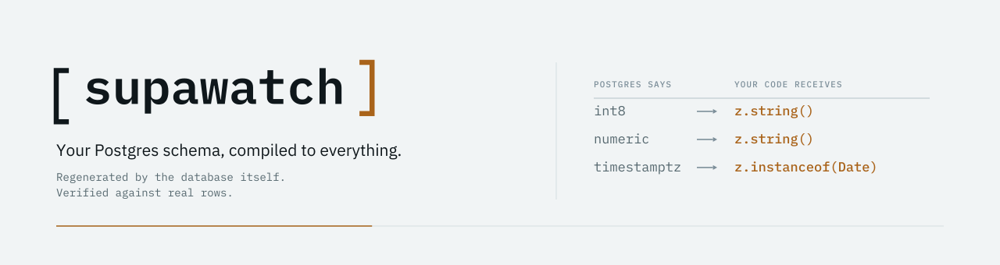

<p align="center">
  <picture>
    <source media="(prefers-color-scheme: dark)" srcset="assets/banner-dark.svg">
    
  </picture>
</p>

<p align="center">
  <a href="https://www.npmjs.com/package/supawatch"></a>
  <a href="https://github.com/omar-dulaimi/supawatch/actions/workflows/ci.yml"></a>
</p>

Your Postgres schema, compiled to everything. A DDL event trigger rings
`pg_notify` on any schema change, a watcher re-runs every generation
target you configured, and everything runnable is verified against real
rows before you trust it. No manual generate step to forget.

Built Supabase-first, works on any Postgres.

## The problem

`supabase gen types` gives you TypeScript types but no runtime
validators, and both go stale the moment anyone touches the schema.
Existing schema-to-Zod tools transform that already-lossy CLI output and
inherit its blind spots.

supawatch reads `pg_catalog` directly, maps types by what your driver
*actually returns* at runtime, and proves every generated schema by
parsing real rows from your database.

## Quick start

```bash
npm install --save-dev supawatch
npm install zod   # peer of the zod target
npx supawatch init
```

`init` writes an event-trigger migration (into `supabase/migrations/`
when a `supabase/` directory exists, `sql/` otherwise) and a
`supawatch.config.ts`:

```ts
import { defineConfig } from "supawatch";

export default defineConfig({
  schemas: ["public"],
  outDir: "src/schemas",
  source: { kind: "listen", debounceMs: 300 },
  targets: [{ kind: "zod", strict: true }],
});
```

Apply the migration like any other, put `DATABASE_URL` in your
environment or in `./.env`, then during development run:

```bash
npx supawatch watch
```

Change the schema from anywhere, a migration, psql, or the Supabase
Studio SQL editor, and the watcher reacts:

```text
[supawatch] baseline: 3 tables, 1 enums, 4 files
[supawatch] ground-truth check, tasks: 3/3 passed
[supawatch] idle, listening on schema_changed
[supawatch] public.tasks gained blocked_reason (text, nullable)
[supawatch] regenerated ... 4 files
[supawatch] ground-truth check, tasks: 3/3 passed
```

## Why the output looks like this

The generated file for a `tasks` table, exactly as emitted:

```js
// Generated by supawatch. Do not edit.
import { z } from "zod";

export const tasksRow = z.strictObject({
  "id": z.string(),
  "project_id": z.number().int(),
  "title": z.string(),
  "status": z.enum(["todo", "doing", "done", "archived"]),
  "due_on": z.instanceof(Date).nullable(),
  "estimate_hours": z.string().nullable(),
  "details": z.unknown().nullable(),
  "created_at": z.instanceof(Date),
});
```

Note `id: z.string()`. The column is `bigint`, and the driver returns
bigints as strings. `estimate_hours` is `numeric`, also a string at
runtime. This is the point of the tool: schemas describe what your code
receives, not what the SQL type chart suggests.

A typed `.d.mts` ships beside every file, so imports are fully typed in
strict TypeScript:

```ts
import { tasksRow, type tasksRowType } from "./src/schemas/zod/index.mjs";

const tasks: tasksRowType[] = rows.map((row) => tasksRow.parse(row));
```

## What it generates

Every target is opt-in. Full descriptions and npm links in
[docs/packages.md](docs/packages.md).

| Area | Targets |
| --- | --- |
| **Validation** | `zod`, `valibot`, `arktype`, `typebox`, `effect`, `json-schema` |
| **Types** | `supabase-types`, `realtime` |
| **API surfaces** | `trpc`, `orpc`, `rest`, `service`, `graphql` |
| **AI** | `mcp`, `ai-tools`, `schema-card` |
| **Testing and data** | `fast-check`, `factories`, `seed`, `pgtap` |
| **Database** | `rls`, `pgmq`, `schema-lock` |
| **Docs and UI** | `erd`, `dictionary`, `forms` |

## Commands

| Command | What it does |
| --- | --- |
| `supawatch init` | Write the event-trigger migration and a starter config. |
| `supawatch generate` | Introspect, generate, verify against real rows, write. One shot, for CI or scripts. |
| `supawatch watch` | The live watcher: event trigger plus LISTEN, debounced regeneration. |
| `supawatch check` | CI drift gate: regenerate in memory, diff against committed files, nonzero exit on drift. Writes nothing. |
| `supawatch doctor` | Verify the setup end to end: connection, installed trigger, a real LISTEN/NOTIFY round trip, config, each target loads. |

## Honest limits

The constraints worth knowing before you adopt it:

- JSON column shapes are `unknown`, because the catalog cannot verify a
  shape the database does not enforce.
- View columns are all nullable, because Postgres reports them that way.
- Generated schemas accept `NaN`, the infinities and BC dates, because
  Postgres really stores them and rejecting real rows would be lying.
- The watcher's LISTEN connection does not work through transaction-mode
  poolers. Use a session pooler, a direct connection, or `poll`.

The full list, each one measured, is in [docs/limits.md](docs/limits.md).
supawatch does not run migrations, build queries, or replace your ORM.

## Documentation

| Page | What is in it |
| --- | --- |
| [Configuration](docs/configuration.md) | Every config field, target options, peer dependencies. |
| [Packages](docs/packages.md) | What each target emits, with npm links. |
| [Driver profiles](docs/driver-profiles.md) | How `postgres-js` and `supabase-js` change the mapping. |
| [Supabase](docs/supabase.md) | The event trigger, and which connection string to use. |
| [Verification](docs/verification.md) | How generated schemas are proven against real rows. |
| [Honest limits](docs/limits.md) | Everything supawatch deliberately does not claim. |

## Status

Pre-1.0, actively developed. The core loop (introspect, generate, verify,
watch) is stable and tested end to end; expect additive changes and
possible config adjustments before 1.0.

## Development

```bash
pnpm install
pnpm run test    # builds, then unit tests on PGlite; no Docker needed
pnpm run e2e     # Docker Postgres 17, pack-install-run consumer, live DDL
pnpm run gate    # both
```

Contributions are welcome; [CONTRIBUTING.md](CONTRIBUTING.md) explains
the one rule that shapes everything else. Releases are changesets-driven.
[MIT](LICENSE).
